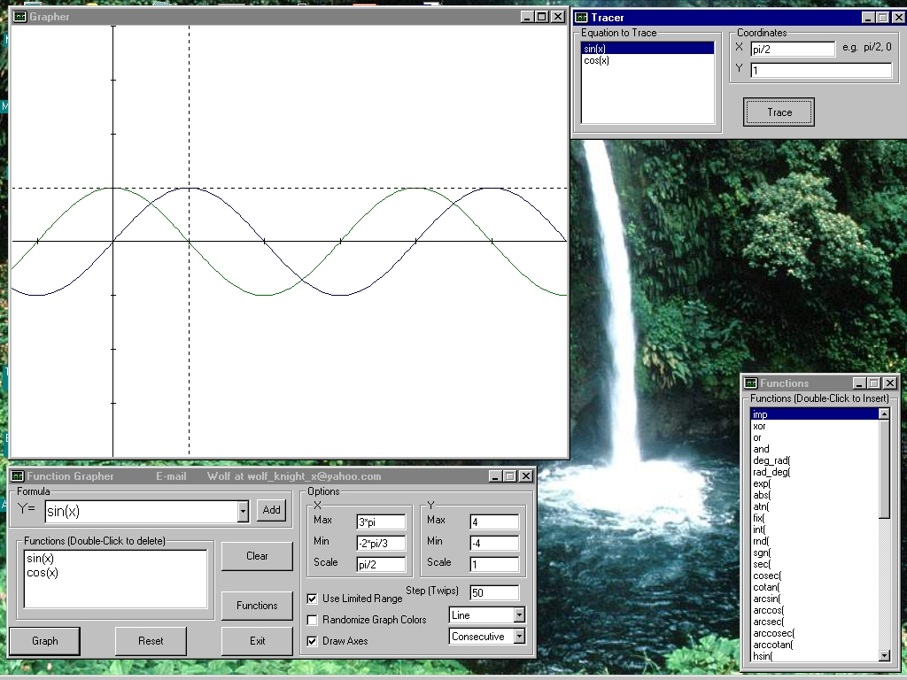



## Function Grapher

### Description

This is a Function Grapher program that is able to take an almost unlimited number of functions the user enters, and graph them, either simultaneously or consecutive, with the first function entered being ploted first.

Function Grapher is built up from my Evaluate (also known as Evaluator) module, which can also be found on Planet Source Code.

Any feedback about this program is greatly appreciated.

Please vote for my program. :-)
 
### More Info
 
The user inputs functions to be graphed.

This is a Function Grapher program that is able to take an almost unlimited number of functions the user enters, and graph them, either simultaneously or consecutive, with the first function entered being ploted first.

Function Grapher is built up from my Evaluate (also known as Evaluate) module, which can also be found on Planet Source Code.

Any feedback about this program is greatly appreciated.

Please vote for my program. :-)

Programs returns the function and is able to trace the function.

For the moment, the overflow is not working exactly as it should be. The trace with the mouse is more accurate than the graph graphed by the program.

             |
---                |---
**Submitted On**   |2000-11-18 23:23:54
**By**             |[Maseraj](https://github.com/Planet-Source-Code/PSCIndex/blob/master/ByAuthor/maseraj.md)
**Level**          |Advanced
**User Rating**    |4.8 (24 globes from 5 users)
**Compatibility**  |VB 6\.0
**Category**       |[Math/ Dates](https://github.com/Planet-Source-Code/PSCIndex/blob/master/ByCategory/math-dates__1-37.md)
**World**          |[Visual Basic](https://github.com/Planet-Source-Code/PSCIndex/blob/master/ByWorld/visual-basic.md)
**Archive File**   |[CODE\_UPLOAD1182611192000\.zip](https://github.com/Planet-Source-Code/maseraj-function-grapher__1-12930/archive/master.zip)

